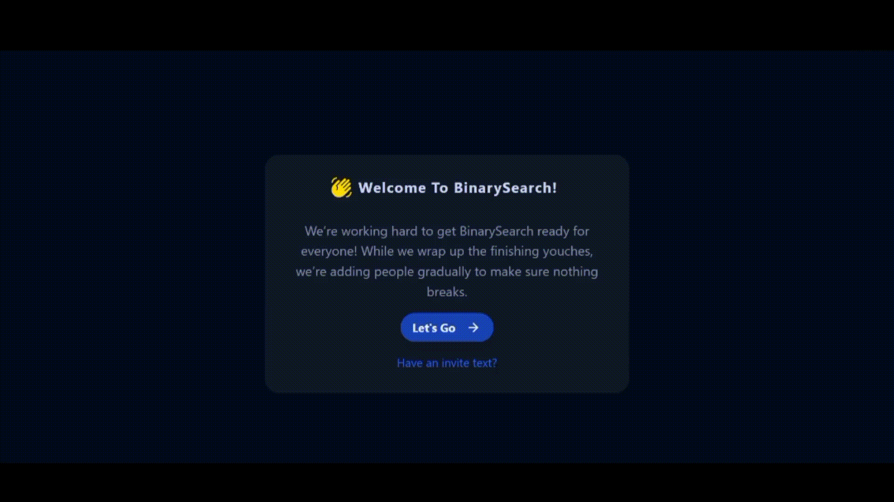
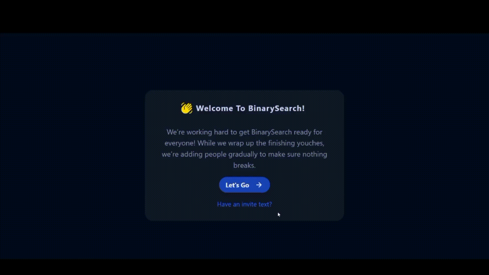

# Binary Search

BinarySearch is a coding platform where users can create space to initiate a live competition with fellow coders and strangers. This web application is created using ReactJS, NodeJS, Express, MongoDB, and Socket.io.

## Authors

- [@chandansahoo](https://github.com/chandansahoo69)

## Features

- Dark Theme
- Live previews
- Fullscreen mode
- Cross platform
- Guest User Functionality

# Demo

### Register



### Login



### Create Room


### AccountPage


## Run Locally

Clone the project

```bash
  git clone https://github.com/chandansahoo69/BinarySearch
```

Go to the project directory

```bash
  cd BinarySearch
```

Install dependencies

```bash
  yarn add
```

Start the server

```bash
  yarn start
```

## Improvements

- Implement create room with strangers, active in platform using match making functionality.

- Implement chat feature during contest.

- Find user and send direct contest link.

## Tech Stack

**Client:** React, Redux, TailwindCSS, Web Sockets

**Server:** Node, Express, MongooDB
